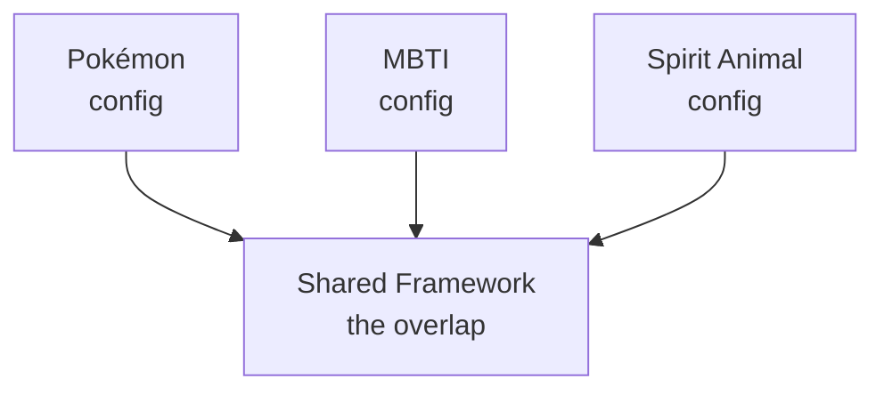
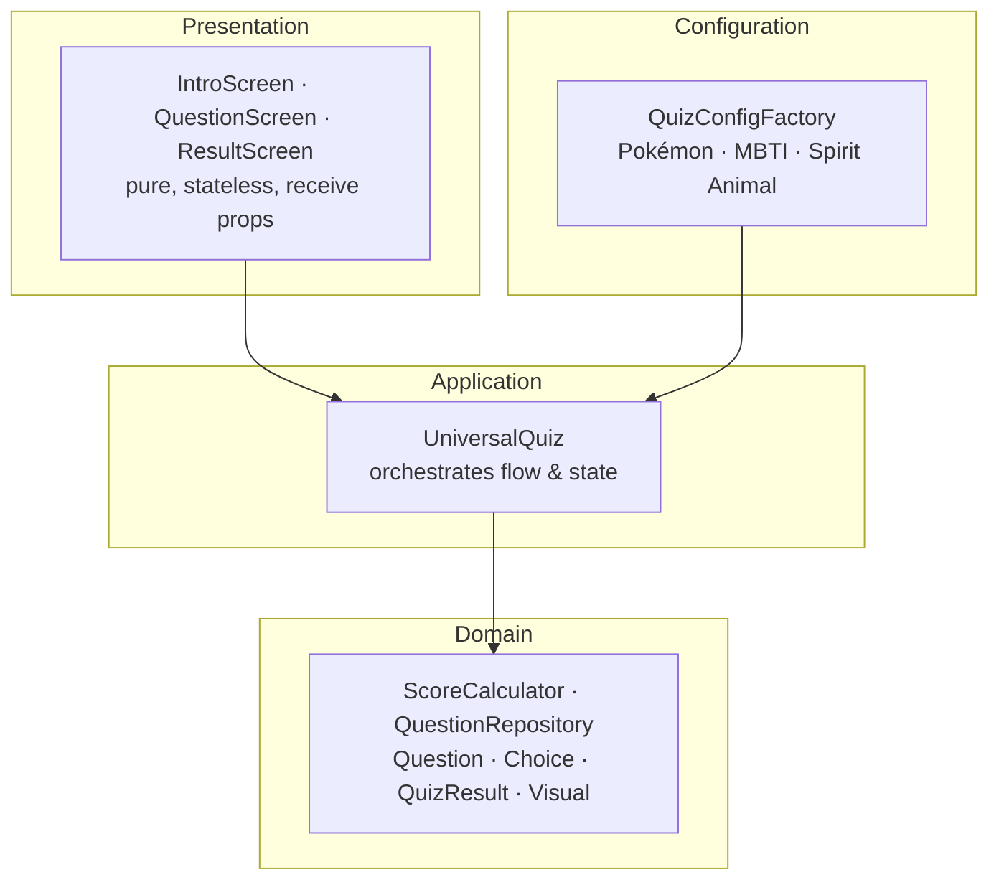
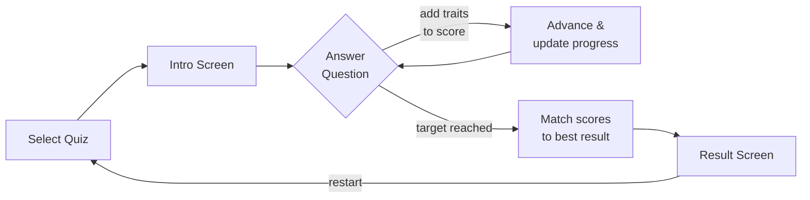

# Universal Personality Quiz Framework
### Design & Architecture Document

> **Implementation status (this repo):** the framework and the **Pokémon** quiz
> ship today. **MBTI** and **Spirit Animal** appear below as illustrative
> configs that demonstrate the framework's intent — adding them is a config-only
> exercise (see §8), not an engine change.

---

## 1. Vision

A single, reusable engine that powers any number of personality quizzes — Pokémon types, spirit animals, MBTI, and whatever comes next — without rewriting the machinery each time. Adding a new quiz should mean writing **only** the content that makes it unique, never the plumbing that every quiz shares.

The guiding metaphor is a **Venn diagram**: everything in the overlap becomes *framework*; everything that differs becomes *configuration*.

---

## 2. Core Intent

| Goal | How it's achieved |
|------|-------------------|
| **Don't repeat yourself** | One engine, three (and counting) configurations |
| **Easy to extend** | New quiz = new config object, zero engine changes |
| **Safe to change** | Engine logic is isolated from content |
| **Readable** | Domain language mirrors the real-world concepts |
| **Testable** | Pure logic separated from UI |

---

## 3. What's Framework vs. What's Configuration

### Framework (the common machinery)
- Quiz state flow: intro → questions → result
- Score accumulation as choices are made
- Matching algorithm (scores → best-fit result)
- Progress tracking
- All UI screens (intro, question, result)
- Navigation and restart logic

### Configuration (what varies per quiz)
- The **questions** (locations, scenarios, choices)
- The **possible results** (types, descriptions, traits, examples)
- The **theme** (colors, emojis, button labels, titles)
- The **number of questions** to answer

A new quiz author touches only configuration. They never open the engine.

---

## 4. Domain-Driven Design (DDD)

The code speaks the language of the problem, not the language of React.

### Domain Models
- **`Question`** — a single prompt: where it happens, the scenario, and the choices
- **`Choice`** — an option: its text, the traits it awards, and where it leads
- **`QuizResult`** — an outcome: name, description, traits, examples, strengths

### Value Objects
- **`Visual`** — an immutable bundle of emoji, gradient, and text color. It has no identity of its own; two identical Visuals are interchangeable.

### Services
- **`ScoreCalculator`** — pure business logic. Accumulates scores and finds the best match. No UI, no state, no side effects.

### Repository
- **`QuestionRepository`** — abstracts *how* questions are stored from *how* they're accessed. The engine asks for a question by ID; it doesn't care where it lives.

### Factory
- **`QuizConfigFactory`** — assembles complete, valid quiz configurations. Each quiz gets its own factory method.

---

## 5. How SOLID & Refactoring Show Up Here

The framework applies SOLID and was refactored out of two near-identical quiz implementations. Rather than restate the general principles, here's where each one concretely shows up:

- **Single Responsibility** — `ScoreCalculator` changes only if scoring rules change; `IntroScreen` only if the intro layout changes.
- **Open/Closed** — adding MBTI required *zero* engine changes, only a new factory method.
- **Liskov Substitution** — the engine treats Pokémon, MBTI, and Spirit Animal configs identically and interchangeably.
- **Interface Segregation** — `ResultScreen` knows nothing about questions; `QuestionScreen` knows nothing about results.
- **Dependency Inversion** — the engine depends on the *abstraction* of a config, injected in rather than hard-wired.

The original duplication (two full copies of quiz logic), oversized components, hardcoded counts, and tight coupling between logic and content were all collapsed into the shared engine plus per-quiz config.

---

## 6. Architectural Layers

Dependencies point **downward and inward**. The domain knows nothing about the UI. The UI knows nothing about how scores are calculated.

---

## 7. How a Quiz Works (Flow)

1. **Selection** — user picks a quiz; the matching config is loaded
2. **Intro** — themed welcome screen invites the user to begin
3. **Questions** — each choice adds traits to a running tally and advances the user
4. **Matching** — after the target number of questions, `ScoreCalculator` compares accumulated traits against every possible result and selects the closest fit
5. **Result** — the winning profile is shown with description, strengths, and examples
6. **Restart** — state resets cleanly for another run

---

## 8. Adding a New Quiz (The Payoff)

To add, say, a "Which Greek God Are You?" quiz, an author writes:

1. A set of **results** (the gods, their traits, descriptions, examples)
2. A set of **questions** (scenarios and choices that award traits)
3. A **theme** (colors, emojis, labels)
4. One **factory method** that bundles them together
5. One **button** in the selector

That's it. No engine code. No UI code. No scoring code. The overlap is already built.

---

## 9. Design Trade-offs & Notes

- **Trait-based matching** keeps results flexible — the same engine handles 6 outcomes or 16 without modification.
- **Configuration as code** (rather than external data files) keeps everything type-safe and co-located, at the cost of slightly larger config objects.
- The **Venn-diagram discipline** is the north star: when in doubt, ask "is this common or does it vary?" Common → framework. Varies → config.

---

## 10. Summary

This is a framework built on a simple, durable idea: **separate the unchanging machinery from the changing content.** DDD gives it a vocabulary, SOLID gives it structure, and disciplined refactoring keeps it clean. The result is a system where the interesting work — writing engaging quizzes — is the *only* work left to do.

*"Anything common becomes framework. Anything that varies becomes configuration."*
